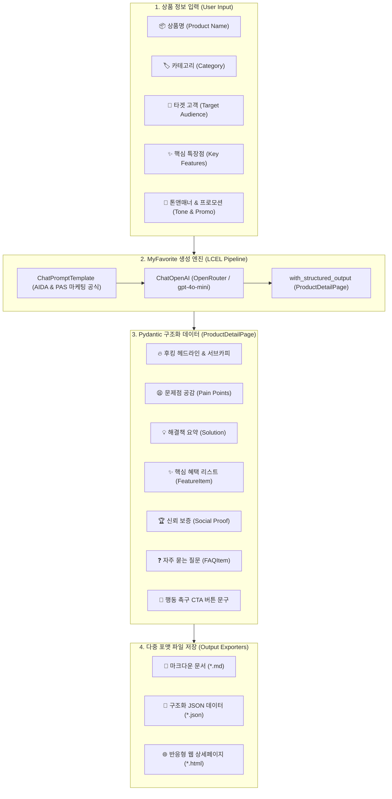
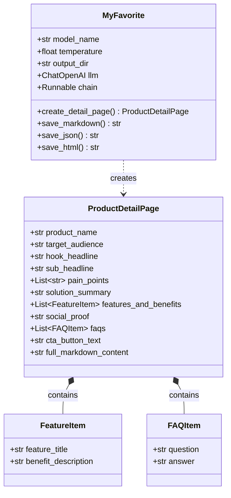
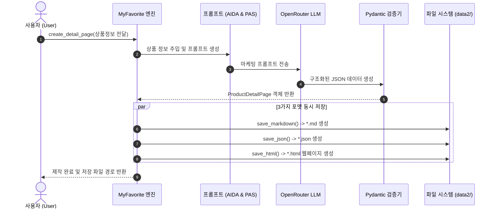

# 🌟 MyFavorite 시스템 구조도 및 가이드 문서

본 문서는 [MyFavorite.py](file:///c:/workAI/work8langchain/MyFavorite.py)의 **Pydantic 스키마 기반 콘텐츠 기획 및 상세페이지 자동 생성 엔진**의 전체 아키텍처와 데이터 흐름을 초보자도 한눈에 이해할 수 있도록 Mermaid 다이어그램과 함께 정리한 가이드입니다.

---

## 1. 전체 아키텍처 및 데이터 흐름도



---

## 2. Pydantic 모델 및 클래스 다이어그램



---

## 3. 상세페이지 생성 시퀀스 다이어그램



---

## 4. 핵심 구성 요소 요약

| 구성 요소 | 설명 | 핵심 역할 |
| :--- | :--- | :--- |
| **`FeatureItem`** | 특징 및 고객 혜택 스키마 | 단순 스펙 나열이 아닌 고객 관점의 실질적 이점(Benefit) 구조화 |
| **`FAQItem`** | 자주 묻는 질문/답변 스키마 | 구매 전 고객의 의문점 및 망설임을 해소 |
| **`ProductDetailPage`** | 전체 상세페이지 데이터 모델 | 헤드라인, 공감 포인트, 솔루션, 혜택, 신뢰 증명, CTA 버튼을 하나의 완성형 모델로 관리 |
| **`MyFavorite`** | 상세페이지 제작 및 저장 엔진 | LangChain LCEL 파이프라인을 실행하고 `.md`, `.json`, `.html` 3종 파일로 즉시 변환/저장 |

---

## 5. 실행 및 활용 방법

```bash
# 콘솔에서 즉시 실행하여 상세페이지 3종 파일 생성
python MyFavorite.py
```

### 📁 생성되는 파일 위치 (`data2/`)
1. **마크다운 상세페이지**: `data2/jeju_hallabong_detail.md`
2. **JSON 데이터**: `data2/jeju_hallabong_detail.json`
3. **웹 브라우저용 반응형 HTML**: `data2/jeju_hallabong_detail.html`
