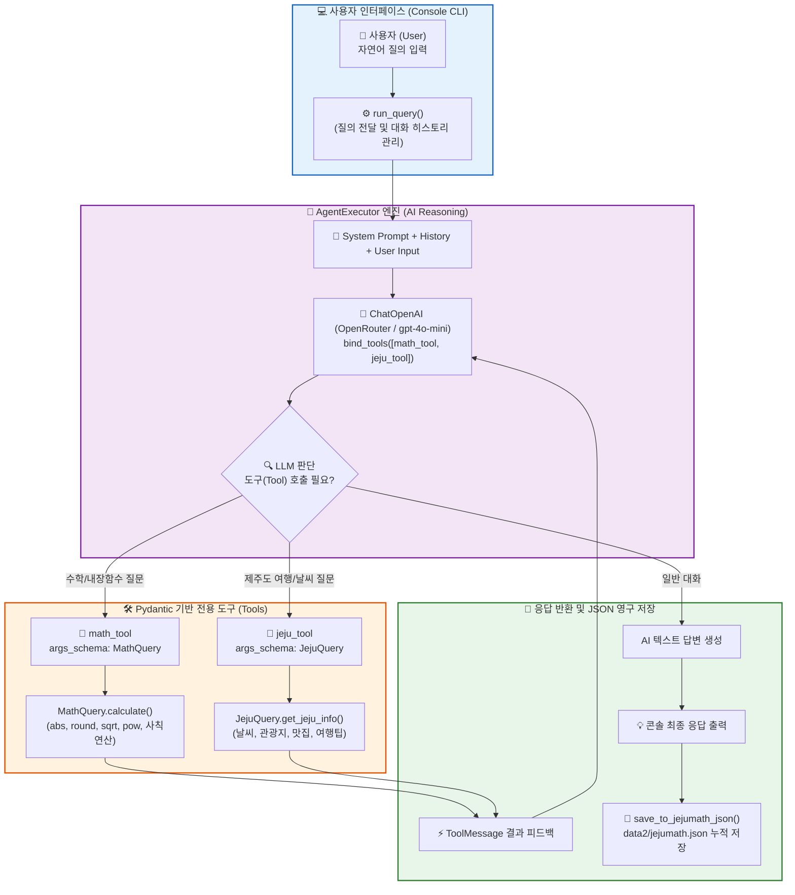
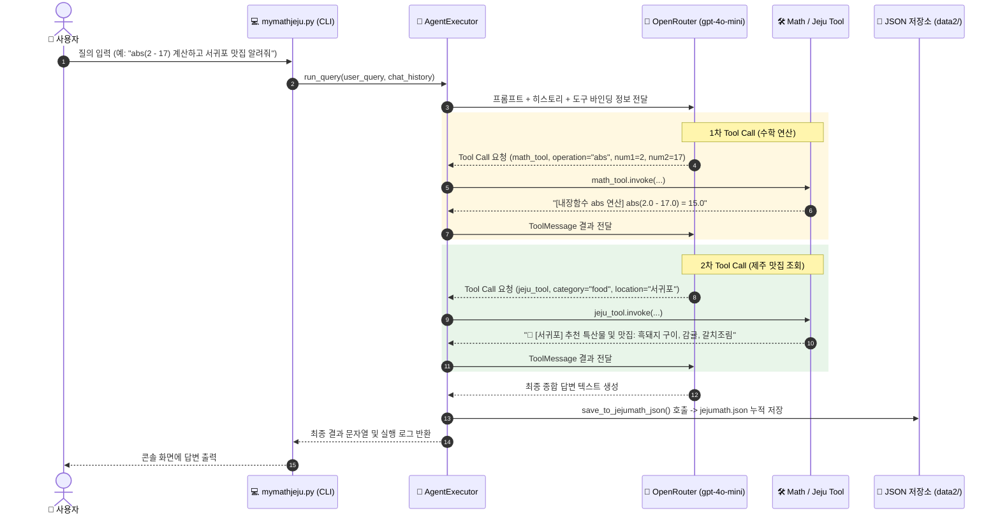
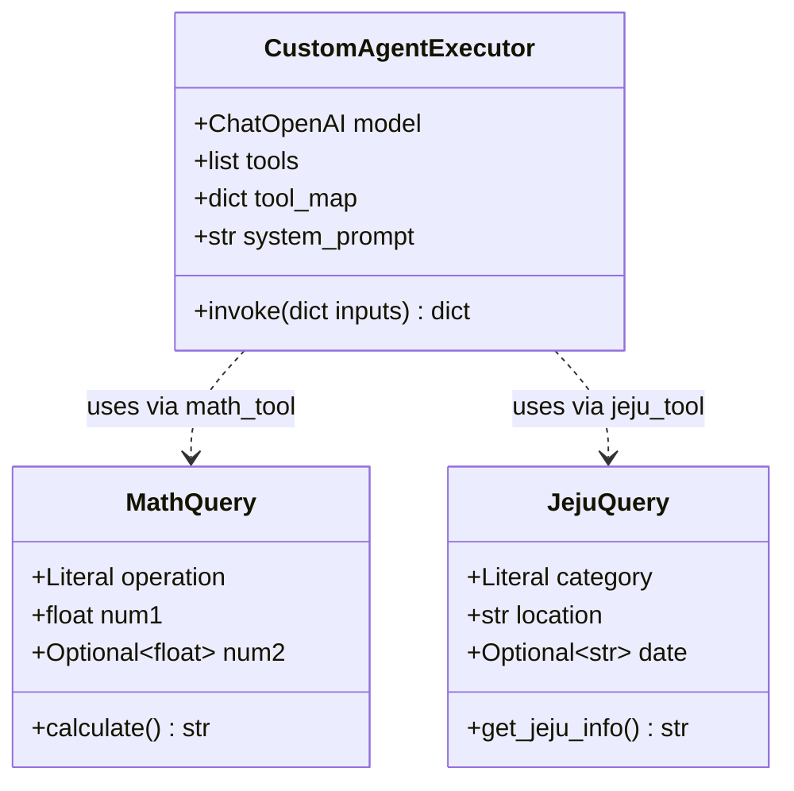

# 🍊 mymathjeju.py 파이프라인 구조도 및 가이드 문서 (AgentExecutor & Tools)

본 문서는 [mymathjeju.py](file:///c:/workAI/work9langchain/mymathjeju.py)의 **수학 내장함수 연산 및 제주 여행 정보 제공 AgentExecutor AI 시스템**의 전체 아키텍처와 데이터 흐름을 초보자도 한눈에 이해할 수 있도록 Mermaid 다이어그램과 함께 정리한 가이드입니다.

---

## 💡 1. 한눈에 보는 전체 시스템 구조도 (System Architecture)

`mymathjeju.py`는 **콘솔 대화형 인터페이스(CLI)**, **AgentExecutor 실행 엔진**, **Pydantic 스키마 기반 Tool**, **OpenRouter API(gpt-4o-mini)**, 그리고 **JSON 데이터 저장소**가 유기적으로 연동되어 작동합니다.



---

## 🧩 2. 핵심 구성 요소별 역할 (Core Components)

### 1️⃣ Pydantic 입력 스키마 (`MathQuery`, `JejuQuery`)
* **`MathQuery`**:
  * `operation`: 수행할 연산 종류 (`abs`, `round`, `sqrt`, `pow`, `add`, `subtract`, `multiply`, `divide`)
  * `num1`, `num2`: 연산 대상 숫자값 검증 및 파이썬 내장함수(`math` 모듈) 기반 연산 실행
* **`JejuQuery`**:
  * `category`: 정보 분류 (`weather`: 날씨, `tourist_spot`: 관광지, `food`: 특산물/맛집, `tip`: 여행팁)
  * `location`: 세부 지역(서귀포, 애월, 제주시 등), `date`: 날짜

### 2️⃣ LangChain Tool (`@tool(args_schema=...)`)
* **`math_tool`**: `MathQuery` 스키마를 바탕으로 AI가 정확한 파라미터로 수학 함수를 호출하도록 가이드
* **`jeju_tool`**: `JejuQuery` 스키마를 기반으로 카테고리별 맞춤 제주 여행 정보 추출

### 3️⃣ CustomAgentExecutor (호환용 에이전트 엔진)
* LangChain 최신 버전 및 구버전 환경 모두에서 안정적으로 작동하도록 구현된 독립 실행 엔진
* LLM의 `tool_calls` 요청을 감지하여 알맞은 도구를 실행하고, 그 결과를 다시 모델에 전달하여 최종 답변 도출

### 4️⃣ 데이터 영구 저장소 (`save_to_jejumath_json`)
* 질의 내용, AI 응답, 실행된 도구 로그(Tool Calls), 타임스탬프를 [data2/jejumath.json](file:///c:/workAI/work9langchain/data2/jejumath.json) 파일에 JSON 형태로 누적 기록

---

## 🔄 3. 데이터 흐름 순서도 (Sequence Diagram)



---

## 📊 4. Pydantic 모델 및 클래스 관계도 (Class Diagram)



---

## 🚀 5. 실행 방법

가상환경(`.venv`)이 활성화된 터미널에서 다음 명령어를 실행합니다:

```powershell
# mymathjeju.py 콘솔 실행
python mymathjeju.py
```

### 📁 실행 결과 저장 위치
- **JSON 로그 파일**: [data2/jejumath.json](file:///c:/workAI/work9langchain/data2/jejumath.json)
